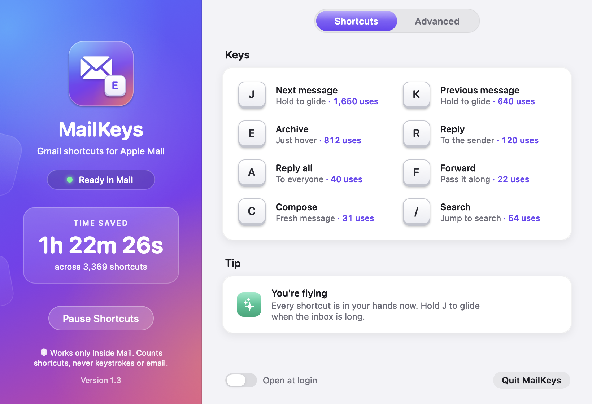

# MailKeys

[](https://github.com/kent/mailkeys/actions/workflows/ci.yml)
[](LICENSE)


Gmail keyboard shortcuts for Apple Mail.

If you've lived in Gmail, your hands know `E`. They know `J` and `K`. Open Apple Mail and those keys do nothing. Your fingers keep reaching anyway.

MailKeys fixes that.

Hover over a message and press `E`. It's archived. No click. MailKeys drops you on the next message, just like Gmail. `J` and `K` move through your inbox. Hold them and you glide.



<sub>The settings window, shown with sample usage stats.</sub>

## The keys

| Key | What it does |
| --- | --- |
| `J` / `K` | Next / previous message. Hold to glide. |
| `E` | Archive the message under your pointer, then move to the next one |
| `R` | Reply |
| `A` | Reply all |
| `F` | Forward |
| `C` | Compose |
| `/` | Search |

`E` works on whatever message your pointer is over. Move the pointer away from the list and `E` archives the selected message instead, as long as the message list has focus. Everything else needs the message list focused.

## Your typing is safe

This was the whole game. A shortcut app that eats the letter `e` while you're writing an email is worse than no app at all.

MailKeys only acts when Mail is in front and you're browsing messages. Search fields are safe. Compose windows are safe. Sheets, dialogs and every other app on your Mac are safe. The rules live in `ShortcutPolicy.swift` and the tests in `PolicyTests.swift` hold them in place.

## Privacy

Short version: it never leaves your Mac.

- The keyboard hook is attached to Mail only. It's a per-process event tap, not a global keyboard listener.
- It never records keystrokes. It never reads your email. It only looks at the structure of Mail's window: which control has focus, which row is under your pointer.
- For the time saved stats it keeps one number per shortcut, how many times you used it, in its own preferences. That's it.

## Test Mode

Nervous about letting an app archive your email? Fair. Turn on Test Mode under **Settings → Advanced**. Press keys in Mail and they light up in MailKeys instead. Nothing happens to your mail.

## Time saved

The sidebar tells you how much time MailKeys has saved you, to the nearest second.

Only shortcuts that actually did something count. Test Mode doesn't count. Holding `J` to glide counts once, not thirty times a second.

The math compares each shortcut with doing the same thing with a mouse, using standard [Keystroke-Level Model](https://en.wikipedia.org/wiki/Keystroke-level_model) timings: reach for the mouse 0.4 s, point 1.1 s, click 0.2 s, press a key 0.28 s. That's about 1.4 s saved per shortcut and 1.6 s per archive. It adds up faster than you'd think. See `Usage.swift`.

## What you need

- macOS 13 or later
- Apple Mail
- Xcode Command Line Tools to build (`xcode-select --install`)

## Build it

```sh
./build.sh
```

That runs the tests, builds `~/Applications/MailKeys.app` and signs it. Open the app and allow it under **System Settings → Privacy & Security → Accessibility**. Look for **MK** in your menu bar.

Want it somewhere else? Set `MAILKEYS_APP_PATH`.

### Signing

Out of the box the app is signed ad hoc. It works, but macOS may ask you to allow Accessibility again after every rebuild. That gets old fast.

Sign it with a stable identity and the permission sticks:

```sh
MAILKEYS_SIGN_IDENTITY="Developer ID Application: Your Name (TEAMID)" ./build.sh
```

Or put that line in a `signing.local` file next to `build.sh`. It's git-ignored.

## Hacking on it

- `./build.sh` runs the policy and stats tests before it builds anything.
- `MAILKEYS_SNAPSHOT=/some/dir path/to/MailKeys` renders the settings window in a bunch of states to PNGs. Handy for design work.
- `./make-icon.sh` regenerates `AppIcon.icns`. The icon is drawn in code in `SettingsUI.swift`.

| File | What's in it |
| --- | --- |
| `main.swift` | The event tap, Mail accessibility checks, the menu bar item |
| `ShortcutPolicy.swift` | The key bindings and the rules for when a shortcut is allowed to act |
| `Responsiveness.swift` | The focus cache and the J/K glide |
| `Usage.swift` | Shortcut counts and the time saved math |
| `SettingsUI.swift` | The settings window and the app icon, all drawn in code |
| `PolicyTests.swift` | Tests |

## Contributing

Issues and pull requests are welcome. Start with [CONTRIBUTING.md](CONTRIBUTING.md), and read [AGENTS.md](AGENTS.md) for the project rules. It works for humans and coding agents alike, and [CLAUDE.md](CLAUDE.md) points Claude Code at it. Found a security or privacy problem? See [SECURITY.md](SECURITY.md).

The one rule that matters most: keep the typing safe.

## License

MIT. See [LICENSE](LICENSE).

MailKeys is an independent project. It isn't affiliated with or endorsed by Apple or Google. Gmail is a trademark of Google LLC, and Apple Mail and macOS are trademarks of Apple Inc.

Let's go.
